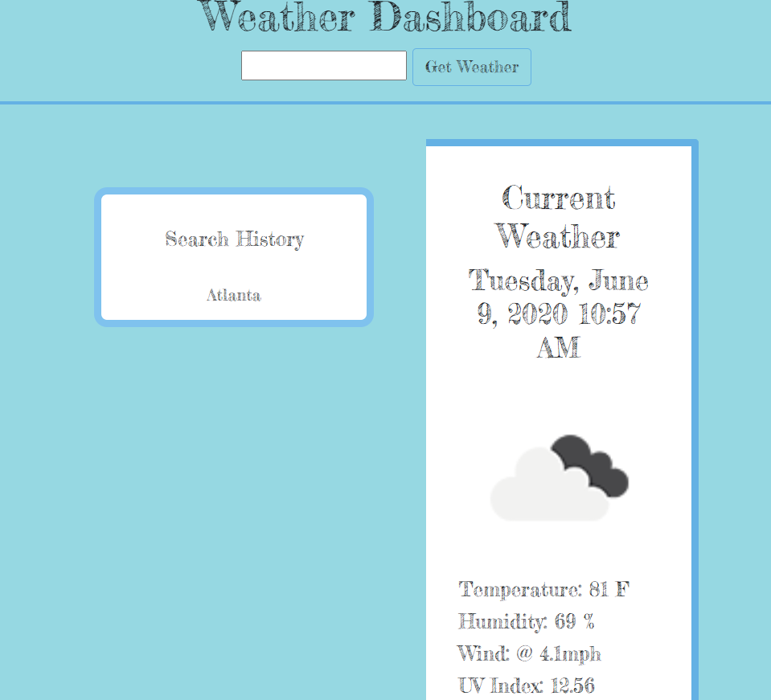
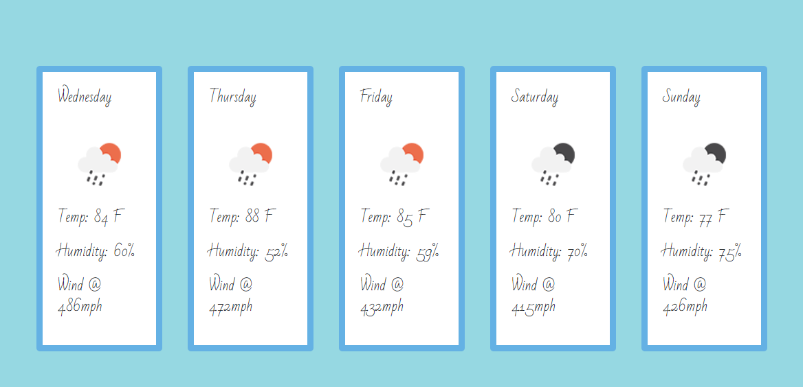

# WeatherChannel
# Live Link 
 https://git-theresa.github.io/WeatherDashboard/

# Contributor
@git-theresa

# Tecnology Stack
* HTML
* CSS
* Bootstrap
* JavaScript
* jQuery

# About
This application allows a user to search a city and see the city's local weather forecast utilizing API Key and AJAX calls.

# License
MIT

# Contact
* Name: Theresa Eatherly [@git-theresa](@git-theresa)
* Webpage: https://github.com/git-theresa/WeatherDashboard
* e-mail: [t.eatherly@gmail.com](t.eatherly@gmail.com)

